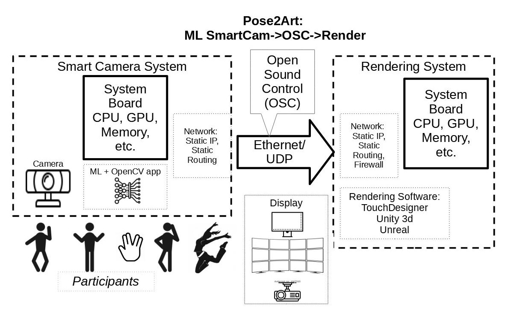

# Pose2Art: smartCamera Pose to TouchDesigner etc

Pose2Art envisions an AI Camera that can run on small 'edge' device that extract Pose and sends tracked points via OSC to TouchDesigner (and Unity/UnReal) for ART!

Similar body tracking has been done for years with markers and/or special cameras, like the Microsoft Kinect. Pose2Art was started circa 2020 to build a system for 2d (maybe 3d) tracking with a basic webcam and some code.  The project went into stasis in 2023 and came out summer 2025.  A lot changed in that time and so has the focus of this project. Most notably there are several camera to pose Components available  for TouchDesigner now. 

This is the closing cycle on this chapter.  I am updating the documentation and Git and then refactoring the project into the PoseCamPC application and TouchDesigner Pose Effects example(s), and maybe Unreal examples.

For deeper writeup see the README_details.md file, and  the Hackaday.io project [Pose2Art: SmartCam to TouchDesigner, Unity via OSC](https://hackaday.io/project/188345-pose2art-smartcam-to-touchdesigner-unity-via-osc).  

 <a href="https://photos.app.goo.gl/w3xXujWq4d156rJC7" target="_blank">Album for Pose2Art demo videos</a> 

---

# PosePC_Multicam Application

The camera (python) app now resides in a subFolder named 'python'.

- setup.bat: run this to setup the python venv
- run.bat: run the posePC_multicam app in venv
- requirements.txt: list of python libraries required, used by setup.bat
- upgrade_pip.bat: setup does it better
- posePC_multicam.py is the primary camera tool. It provides a TKinker UI and sends both OSC messages and NDI video.  Allows file or webcam (drop down list) selection for input. Fields for ip, port and ndi name. buttons to independently start/stop OSC and NDI sending streams.  be sure to start both!
- **pose_detector** package (subfolder) 
  - **pose_detector.py**: PoseDetector base class
  - **pose_detector_mediapipe**: PoseDetectorMediapipe version
  - **alphapose.py** : stub that might support alphapose

Note there were issues with released version of NDI Tools. So the NDI folder contains a python wheel for a locally built package. See that package's git issues for discussion.

the old folder contains older versions of the tool, for histerical reasons

# TouchDesigner Examples

The top level here has several TOE - touchDesigner projects built to exercise the camera and explore effects and usage pattern.  Most support both the OSC and NDI streams. The NDI source needs to be manually set each time you start one of these.  Be sure the PosePC camera has started sending both streams 

osc_fluidHand.toe is the most evolved file. It is annotated (internally documented) showing how the OSC parsing and Effect generation works.  It implements fluid emitters on the two hand tips.

The other tools are ok but not nearly as evolved.

- **poseOSC_dots.toe** is a simple TouchDesigner app that reads the osc landmark messages and displays them as dots.
- **handDrawing.toe**: revision of example from HQPro to use OSC instead of kinect (part of paid course)
  -- [Immersive Design & Creative Technology Mini-Degree/Pillars/Kinect 2 Fundamentals/05 - Drawing with Kinect Skeleton Data](https://hqpro.interactiveimmersive.io/products/immersive-design-creative-technology-mini-degree/categories/2151460601/posts/2162173127)
- **handDrawing_wNDI.toe**: TD app maps over ndi from posePCGui 
- **landmarksAsSpheres.toe** puts a sphere at each landmark (incl face?)
- **landmarksAsGeom_wNDI.toe** similar to sphere, also rcvs video via NDI
- **handsAsEmitters.toe** particle emitters at hand tips (vid save to file)
- **OSC_TubularTrim.toe** make flat/tube skeleton between landmarks
- **osc_fluidHand.toe** fluid emitter on hands using two [Fluid_simulation.tox](https://derivative.ca/community-post/asset/fluid-simulation-component/65741)

### Credit Where Credit Due

The initial code is derived from other projects on GitHub/web.
- **pose_PC_MediaPipe.py** and TouchDesigner **poseOSC_dots.toe** come from [cronin4392's TouchDesigner-OpenCV-OSC project](https://github.com/cronin4392/TouchDesigner-OpenCV-OSC) (MIT License)
- Fluid Simulation relies on [Bruno Imbrizi's youTube tutorial](https://www.youtube.com/watch?v=2k6H5Qa_fCE) and Kurt Kaminski's uploading of that as a [TOX on Community.Derivative](
https://derivative.ca/community-post/asset/fluid-simulation-component/65741).  Kurt has a [revised version on GitHub](https://github.com/kamindustries/touchFluid)

